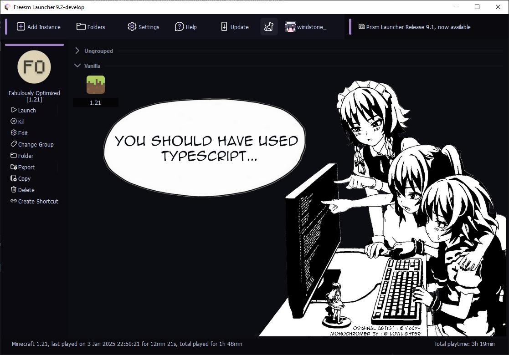
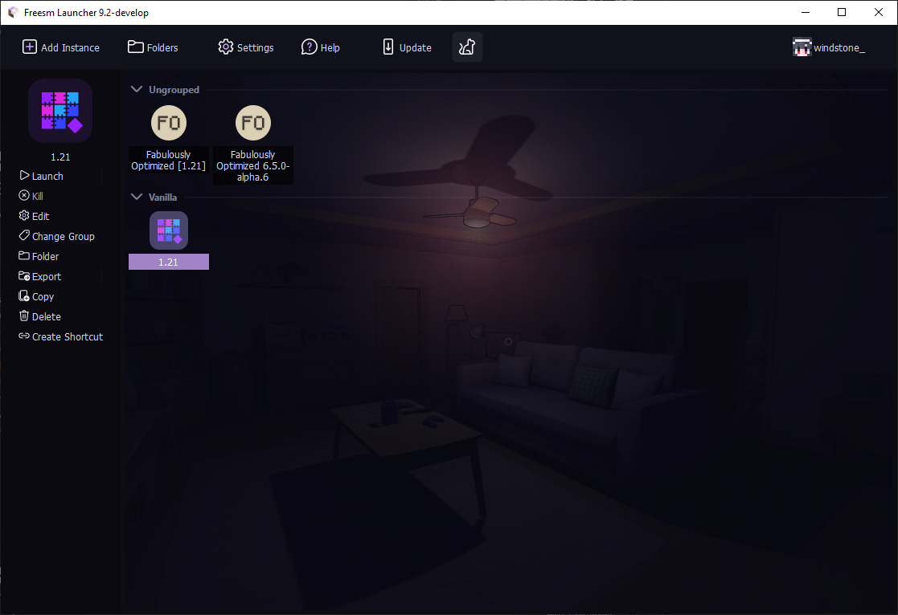
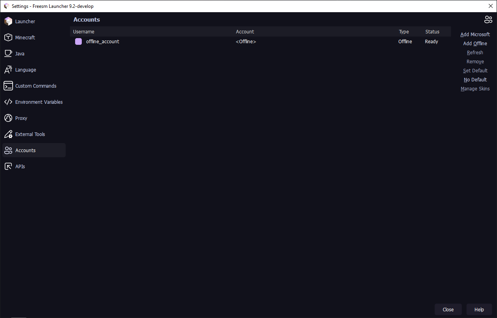
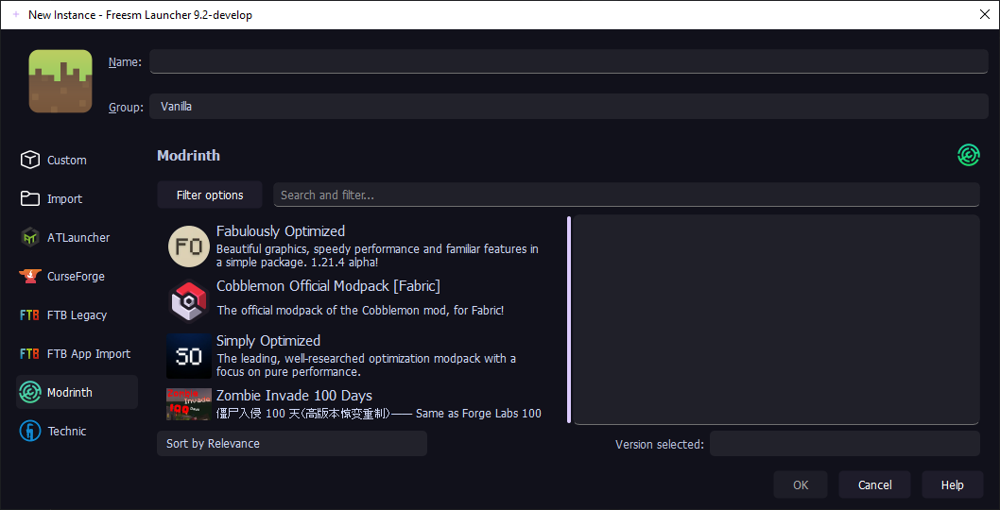
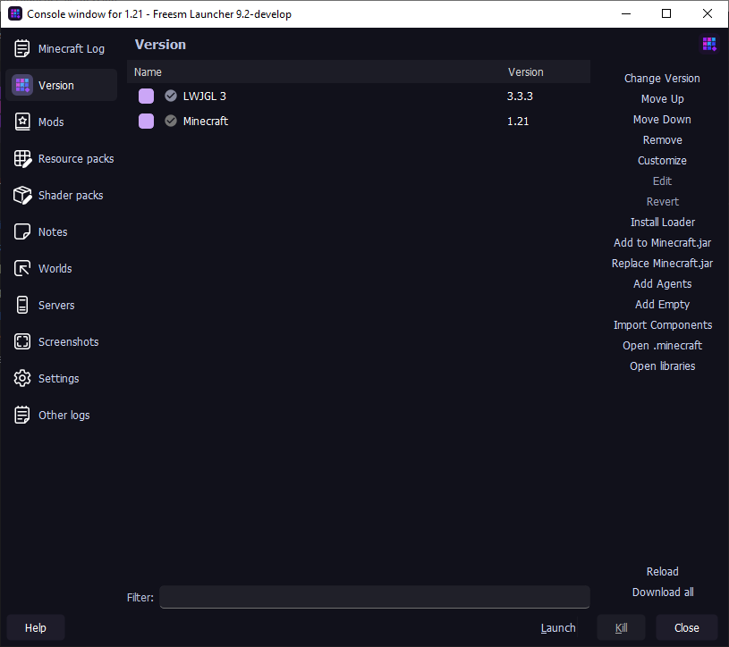
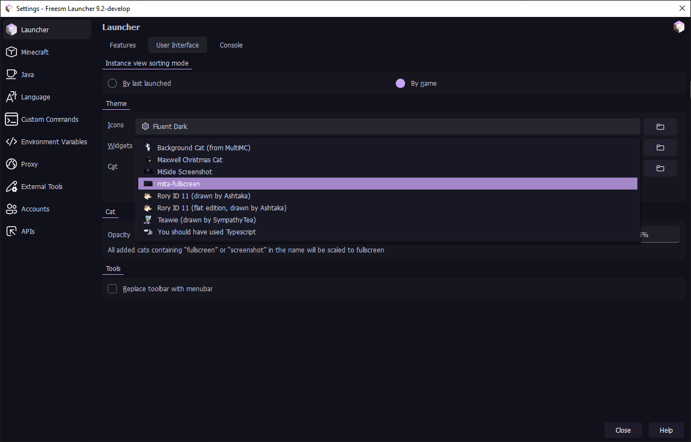

<h1>
<a style="color:#e8a33d" href="https://github.com/Sudo-Ivan/BeeLauncher">Bee Launcher</a>
</h1>

A FreesmLauncher fork that **removes offline account restrictions**, adds custom auth server support, and provides more customization

This fork is **not** endorsed by FreesmLauncher or Prism Launcher

Based on FreesmLauncher (Prism Launcher **11.1.1**)

<strong>English</strong> | <a style="color:#e8a33d" href="./README_ru.md">Русский</a>

## Screenshots

  
Show

  

    

      
      
      
      
      
      
    

  

## Features

- Offline mode doesn't require signing in with a Microsoft account anymore
- [Ely.by](https://ely.by/) can be used as an account auth option, providing a seamless integration with Minecraft. You will see your Minecraft skin anywhere without any mods or plugins
- Custom authentication server support
- Polished, minimalist dark and light themes based on a [Fluent-Dark](https://github.com/PrismLauncher/Themes/tree/main/themes/Fluent-Dark) theme with honey accent colors and [Microsoft Fluent](https://fluent2.microsoft.design/iconography) icons
- In-game screenshots copying to the buffer history without any mods support
- Animated snow effect for those who love... snow?
- Random username and instance icon selection with ultra-super-advanced and cryptographically secure, absolutely random number generator based on the [lavarand](https://www.youtube.com/watch?v=dQw4w9WgXcQ)
- FLOSS
- ...all the Prism Launcher's features

## Comparison

| Feature                                  | Bee  Launcher | Freesm Launcher | Shattered  Prism | HMCL | Fjord   | PollyMC       | PineconeMC      | UltimMC | Prism-Cracked | Prism Launcher |
|------------------------------------------|---------------|-----------------|------------------|------|---------|---------------|---------------|---------|---------------|----------------|
| Offline Mode without a Microsoft account | ✅             | ✅               | ✅                | ✅    | ❌       | ✅             | ✅             | ✅       | ✅             | ❌              |
| FTB packs                                | ✅             | ✅               | ✅                | ❌    | ✅       | ✅             | ✅             | ❌       | ✅             | ✅              |
| Ely.by support                           | ✅             | ✅               | 🟨¹              | 🟨¹  | 🟨¹     | 🟨¹           | ✅             | 🟨¹     | ❌             | ❌              |
| Authlib-injector support                 | ✅             | ✅               | ✅                | ✅    | ✅       | ✅             | ✅            | ❌²      | ❌²            | ❌²             |
| Screenshots saving to the buffer history | ✅             | ✅               | ❌                | ❌    | ❌       | ❌             | ❌             | ❌       | ❌             | ❌              |
| Discord Rich Presence                    | ❌             | ✅               | ❌                | ❌    | ❌       | ❌             | ❌             | ❌       | ❌             | ❌              |
| Built-in news feed                       | ❌             | ✅               | ❌                | ❌    | ❌       | ❌             | ❌             | ❌       | ❌             | ❌              |
| Cat packs and anime content              | ❌             | ✅               | ❌                | ❌    | ❌       | ❌             | ❌             | ❌       | ❌             | ❌              |
| Fork                                     | FreesmLauncher | PrismLauncher   | FjordLauncher    | ❌    | PollyMC | PrismLauncher | PrismLauncher | MultiMC | PrismLauncher | PolyMC         |

¹ doesn't use official Ely.by authlib patches

² you can still change a `javaagent` JVM argument to use your `authlib-injector` jar file as an auth server

Bee Launcher also disables the built-in updater and the upstream network integrations it had no replacement for, such as news, socials and update checks.

## Installation

### Stable Releases

Download Bee Launcher from our [official website](https://github.com/Sudo-Ivan/BeeLauncher) or the [GitHub Releases](https://github.com/Sudo-Ivan/BeeLauncher/releases) page. Packages are available for **Linux, Windows, and macOS**.

### Development builds

Please understand that these builds are not intended for most users. There may be bugs and other instabilities. You have been warned.

There are development builds available through:

* [GitHub Actions](https://github.com/Sudo-Ivan/BeeLauncher/actions) (includes builds from pull requests opened by contributors).
* [nightly.link](https://nightly.link/Sudo-Ivan/BeeLauncher/workflows/build/master) (this will always point only to the latest version of the `master` branch).

These builds contain debug information in the binaries, so their file sizes are relatively larger. Prebuilt Development builds are provided for **Linux, Windows, and macOS**.

## Community & Support

If you found a bug or want to suggest a feature, please open an issue in [GitHub Issues](https://github.com/Sudo-Ivan/BeeLauncher/issues). Pull requests and contributions (code, docs, translations) are welcome!

